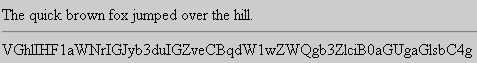

# [Lewie's Code Library PSC](../../README.md)

Open source projects that I had published to Planet Source Code.

## [Classic ASP / vbScript](../README.md)

### Base 64 Encode / Decode

*7/18/2000 11:25:01 AM*

Base 64 encodeing is used to convert binary files to a "safe" format for transporting files through smtp (email) and other protocols. It is also used for basic authentication. With this code, you can decode the current UserName/Password who is visiting a protected page on your site by requesting one of the serverVariables.

