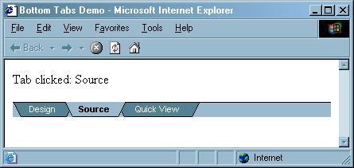

# [Lewie's Code Library PSC](../../README.md)

Open source projects that I had published to Planet Source Code.

## [Classic ASP / vbScript](../README.md)

### Bottom Tabs

*3/1/2002 7:44:12 PM*

Simulate the tab control found at the bottom of popular programs such as visual Interdev and Front Page.

