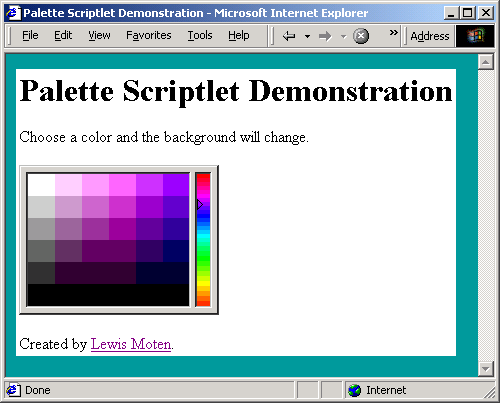

# [Lewie's Code Library PSC](../../README.md)

Open source projects that I had published to Planet Source Code.

## [Classic ASP / vbScript](../README.md)

### Color Palette Scriptlet

*4/28/2001 5:27:03 PM*

Allows users to choose a color from a palette simular to Adobe's color palette.

