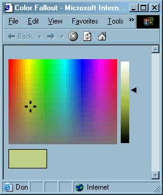

# [Lewie's Code Library PSC](../../README.md)

Open source projects that I had published to Planet Source Code.

## [Classic ASP / vbScript](../README.md)

### Color Picker (Fallout)

*2/28/2002 10:35:56 PM*

Allow users to choose colors from familiar interfaces that are standard to the windows operating system. This one displays a wide range of hues in a color spectrum and fades the saturation. An additional scriptlet appears to change the luminance of each color chosen.

