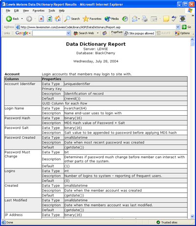

# [Lewie's Code Library PSC](../../README.md)

Open source projects that I had published to Planet Source Code.

## [Classic ASP / vbScript](../README.md)

### Data Dictionary Report Generator

*7/28/2004 10:12:34 PM*

Retrieves the structure of your data and displays it into a nice report that you can copy & paste into word documents. Works with SQL Server 2000. Also lists any comments within the database for tables & columns.

