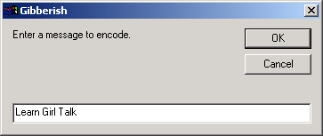

# [Lewie's Code Library PSC](../../README.md)

Open source projects that I had published to Planet Source Code.

## [Classic ASP / vbScript](../README.md)

### Gibberish Encoding

*3/13/2002 9:37:00 PM*

Quick way to learn how to speak gibberish. It is sometimes known as "girl-speak".

