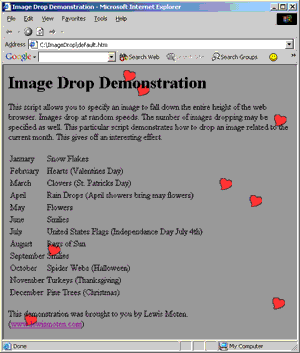

# [Lewie's Code Library PSC](../../README.md)

Open source projects that I had published to Planet Source Code.

## [Classic ASP / vbScript](../README.md)

### Image Drop

*7/6/2002 11:28:59 AM*

This script allows you to specify an image to fall down the entire height of the web browser. Images drop at random speeds. The number of images dropping may be specified as well. This particular script demonstrates how to drop an image related to the current month. This gives off an interesting effect.

