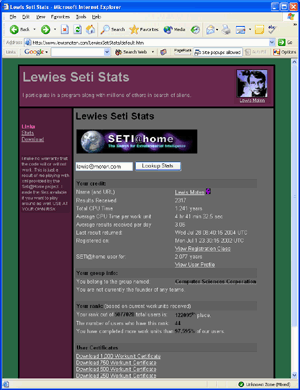

# [Lewie's Code Library PSC](../../README.md)

Open source projects that I had published to Planet Source Code.

## [Classic ASP / vbScript](../README.md)

### Lewies Seti Stats

*7/29/2004 12:14:57 AM*

Reads an Xml file from the Seti@Home projects web servers and allows you to display the information on your own website. Cache xml files for up to 8 hours and loads via. javascript. Compatible with Netscape, Mozilla, FireFox, and MSIE.

