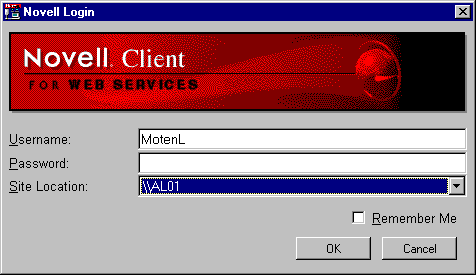

# [Lewie's Code Library PSC](../../README.md)

Open source projects that I had published to Planet Source Code.

## [Classic ASP / vbScript](../README.md)

### Novell ASP Login

*7/28/2000 11:11:07 AM*

This login code validates users against a novell server and gives the look and feel of a Novell Client login screen.

