# [Lewie's Code Library PSC](../README.md)

Open source projects that I had published to Planet Source Code.

## Classic ASP / vbScript

### [Input Date](./InputDate/README.md)

*7/18/2000 10:42:49 AM*

This small snippet will generate 3 drop down boxes that will allow your users to choose a date.

### [Convert Bytes](./ConvertBytes/README.md)

*7/18/2000 10:48:45 AM*

This code convert bytes into larger units such as kilobytes, megabytes, gigabytes, and terabytes. I use this with the FileSytemObject so that my users do not see a very large number that doesn't make any sense.

### [Convert StringIP to NumericIP](./ConvertStringIPToNumericIP/README.md)

*7/18/2000 10:55:26 AM*

Converts a string ip address ("192.168.0.1") to a Long number (3232235521). One of the resons to do this would be to store IP addresses in databases. Numbers greatly reduce the size required to store this information.

### [Convert LongIP to StringIP](./ConvertLongIPToStringIP/README.md)

*7/18/2000 11:01:22 AM*

This function converts a Long Number(3232235521) into an IP Address ("192.168.0.1").

### [Credit Card Mod 10 Validation](./CreditCardMod10Validation/README.md)

*7/18/2000 11:14:28 AM*

Based on ANSI X4.13, the LUHN formula (also known as the modulus 10 -- or mod 10 -- algorithm ) is used to generate and/or validate and verify the accuracy of credit-card numbers.

### [Base 64 Encode / Decode](./Base64EncodeDecode/README.md)

*7/18/2000 11:25:01 AM*

Base 64 encodeing is used to convert binary files to a "safe" format for transporting files through smtp (email) and other protocols. It is also used for basic authentication. With this code, you can decode the current UserName/Password who is visiting a protected page on your site by requesting one of the serverVariables.

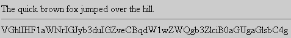

### [Strip HTML](./StripHTML/README.md)

*7/18/2000 11:30:58 AM*

Strips any HTML tags from a string and returns the results. I use this for data that users submit through forms to prevent them from using HTML.

### [Common Database Routines](./CommonDatabaseRoutines/README.md)

*7/18/2000 1:06:29 PM*

To assist in interfacing with databases. This script can format variables and return SQL formats. Such as double quoting apposterphies and surrounding strings with quotes, Returning NULL for invalid data types, trimming strings so they do not exceed maximum lengths. This also has some functions so that you can open and close databases more conveiently with just one line of code. You can query a database and get an Array as well with some code.

### [Remote File Explorer](./RemoteFileExplorer/README.md)

*7/19/2000 12:09:01 PM*

This script allows you to browse the file system on a remote computer through your web browser.

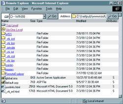

### [Total Email Validation](./TotalEmailValidation/README.md)

*7/21/2000 10:35:08 AM*

Validates email addresses. Makes sure the email addresses with IP addresses are not private network addresses. Allows multiple sub-domain levels. verifies characters within domain names. only allows standard length 26 characters for each domain name level, except the top (3 max)

### [File/Path/Extension Stripping](./FilePathExtensionStripping/README.md)

*7/21/2000 12:23:39 PM*

These routines can strip a file name from a path, a directory from a path, and an extension from a path. They can also determine the parent directory path. They are fairly simple routines that I use in misc. places.

### [Get In Frames](./GetInFrames/README.md)

*7/21/2000 1:59:41 PM*

Search engines point users to individual web pages. If the page is supposed to be displayed within a set of frames, this code will redirect the users to a specific page using javascript. From there, the new page parses which page it should display and loads up the frames accordingly.

### [vbScript to HTML Color Coder](./vbScriptToHTMLColorCoder/README.md)

*7/23/2000 12:27:13 PM*

Converts vbScript to HTML to show your code on web pages. Also provides features so that clicking on keywords will create a small pop-up window explaining some details about that keyword and provide a link with more details.

### [Novell ASP Login](./NovellASPLogin/README.md)

*7/28/2000 11:11:07 AM*

This login code validates users against a novell server and gives the look and feel of a Novell Client login screen.

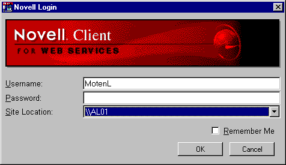

### [Sorted Record Listing with Search](./SortedRecordListingWithSearch/README.md)

*8/1/2000 2:56:15 PM*

This script displays records retrieved from the database. You can sort each field and jump to any page in the database. You can customize the records per page and all the colors. You may also attatch a style sheet to change the colors of each class type. this script is very close to being XML compatable. (still in the works).

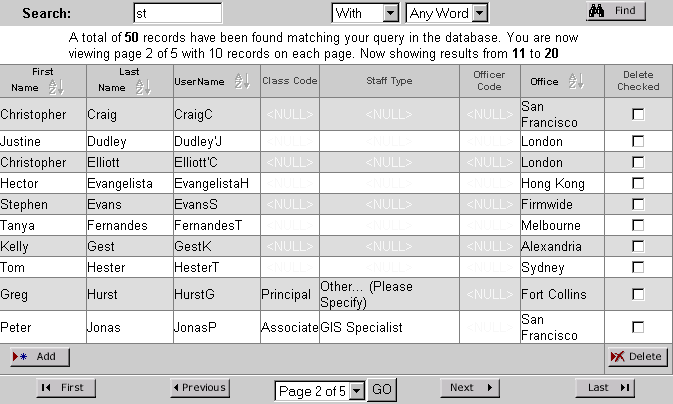

### [Advanced SQL Query Builder](./AdvancedSQLQueryBuilder/README.md)

*8/3/2000 10:57:26 PM*

This code lets visitors to your site perform complex queries. Users may choose if specific words (or phrases) must or must not match - or if they are optional (default).

### [Link URLs](./LinkURLs/README.md)

*8/4/2000 12:06:32 PM*

Finds any URL found within specified text and creates a hyper link for http, https, ftp, and email addresses.

### [Server Timezone Offset](./ServerTimezoneOffset/README.md)

*8/26/2000 3:25:17 PM*

Returns the hour difference of the servers time from GMT.

### [AuthenticateUser](./AuthenticateUser/README.md)

*1/12/2001 2:42:27 PM*

Authenticates a user to make sure if they have previously logged into the site. Requires Session("UserID") to be populated. This usually represents the Users ID within a data base. (Users.UserID) If a user is not loged in, they are redirected to a page to attempt a login. This is useful when the ability to "Auto-Login" has been enabled to use previously saved login information in the users cookies. When a user is redirected to the login page, The URL they were attempting to view is passed along in the Query String along with the reason why they need to login. If the user was posting data to the protected page (perhaps a session timed out), then the previous page they were posting from is sent as the URL that the user is redirected to after they have successfully logged in. This is done to help reduce errors when visiting a page that expected posted form data.

### [LoginNow](./LoginNow/README.md)

*1/12/2001 4:32:52 PM*

Attempts to log a user into the web site through either cookies or posted form data by validating UserName and password against a database. Redirects users to originally requested pages. Saves/Refreshes/Deletes login data into cookies if requested by user.

### [Upload Files Without COM](./UploadFilesWithoutCOM/README.md)

*1/13/2001 4:56:05 PM*

Allows you to upload multiple files and fields without purchasing or registering COM objects. Great for shared hosts that frown upon 3rd Party com objects or charge an arm and a leg for them. This version uses Classes rather then the dictionary object that I have seem most other people use. Dictionary Objects seem to be flakey with more problems. I have added examples of how to upload a file to a database and the file system. A file is also included that retreives the file from the database.

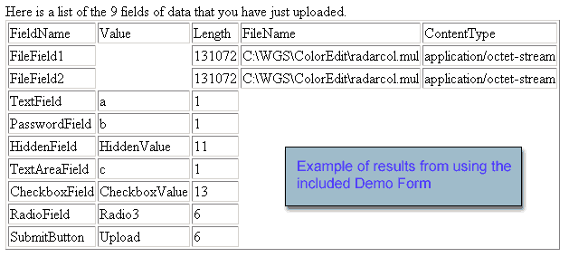

### [Sorted Record Listing with Search v2.0](./SortedRecordListingWithSearchV2.0/README.md)

*1/21/2001 1:44:57 PM*

After getting great reviews on the previous version, I finally got time to do the rewrite that I promised everyone. This code allows you to easily create lists of your data with pagination, sorting, and filtering. The end result is a very nice layout of your data. You choose which fields come back (an the captions for each one in the header). Choose which fields are searched. Setup the default field that is sorted when visitor first views page. Now supports databases with list ordering. This time I have included a database so it should work as soon as you add the files to your website.

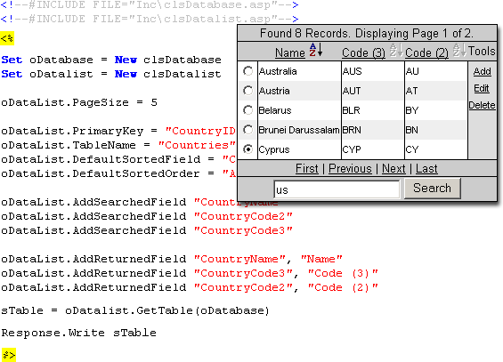

### [Phone Number Conversion](./PhoneNumberConversion/README.md)

*2/9/2001 12:53:26 PM*

This class is used to interpret phone numbers to and from a database in a specific format. The format is 25 characters long and is explaied withing the script.

### [Whois Lookup](./WhoisLookup/README.md)

*2/18/2001 1:40:49 PM*

Shows how you can do a WhoIs lookup using a COM object capable of using winsock.

### [Scripting.Decoder for Microsoft Encoding](./Scripting.DecoderForMicrosoftEncoding/README.md)

*3/11/2001 5:15:43 PM*

This code lets you decode your scripts. It comes in handy if you deleted the original file or wrote over it with the encoded version. Microsoft included a program to encode, but choose not to let us decode with a scrdec program. More details can be found on my site about this script including a live demonstration. Please leave comments here if you wish to inquire about it.

### [SHA-1 Hash Algorithm](./SHA-1HashAlgorithm/README.md)

*3/22/2001 12:20:44 PM*

for computing a condensed representation of a message or a data file.

### [Client Bandwidth Recorder](./ClientBandwidthRecorder/README.md)

*4/12/2001 11:10:52 PM*

Measures the bandwidth in kbps (kilobits per second) that the client is viewing your website at. Works with modems, dsl, cable modems, network cards and any other means of connecting to the internet.

### [Add Custom Errors with MetaBase](./CustomErrors/README.md)

*4/28/2001 12:12:53 PM*

This script interacts with COM objects that communicate with the MetaBase for Internet Information Server. You will be able to define the custom error pages for your website.

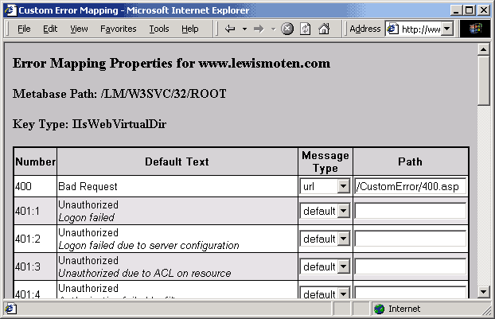

### [Color Palette Scriptlet](./ColorPaletteScriptlet/README.md)

*4/28/2001 5:27:03 PM*

Allows users to choose a color from a palette simular to Adobe's color palette.

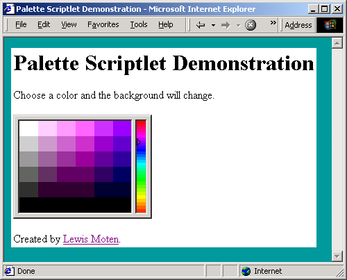

### [Dynamic Pixel Image](./DynamicPixelImage/README.md)

*4/29/2001 11:23:59 AM*

Allows you to create 1x1 images of any color including transparent images. (Images can be streatched by defining height and width in image tag)

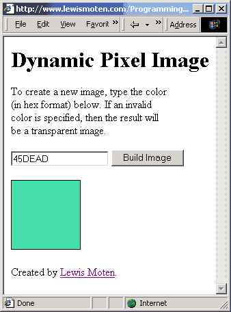

### [Color Picker 2](./ColorPicker2/README.md)

*4/29/2001 1:00:17 PM*

This version of the Color Picker supports just about any browser that uses javascript - Including Netscape 3. The downfall is that you "must" run it with a server that allows ASP. A script is included to create "dynamic" images of various colors. Thus - more bandwidth is used to allow visitors to choose colors. It is still a great asset to anyone who wishes to allow users to pick colors dynamically to affect the sites layout and design instantly.

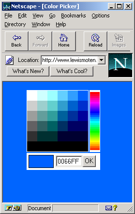

### [Dynamic Curve Images](./DynamicCurveImages/README.md)

*4/29/2001 2:33:00 PM*

The script is able to dynamically create GIF images. The 4 positions of a curve - Top Right/Left and Bottom Right/Left. It also creates a transparent image if the position isn't defined. The images returned are 16x16 pixels - except for the transparent image that is 1x1. The curves are made by two colors (Background and Foreground) that you specify. The script calculates all colors in between and returns an image that appears Anti-Aliased (no jagged edges). This script was made to help users customize there own colors, yet still be able to use images throughout the site that do not lock specific colors into the scheme. This demonstration shows the dynamic image generation in action. 4 rounded corners are created with aliasing to prevent that "blocky" edge on the corners. Simply enter an HTML color (in hex format) in the form below. If an invalid color is specified, then that color will default to either white (Color1) or Black (Color2).

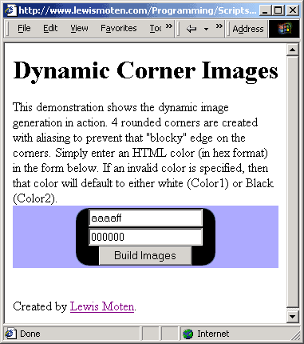

### [Read GIF Dimensions](./ReadGIFDimensions/README.md)

*4/29/2001 4:37:45 PM*

Reads the Width and the Height of a GIF image. Really nice to have if you need to limit your users with specific image dimensions for profile images, banners, buttons, etc.

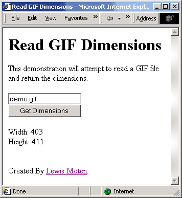

### [How to make Dynamic GIF Color Palettes](./HowToMakeDynamicGIFColorPalettes/README.md)

*4/30/2001 12:13:34 PM*

In this article, I will walk you through the entire process on how to property create the GIF images, and then transfer them to my custom template file format. From there, an ASP page can read these templates, generate a color palette, and return a GIF image to the browser.

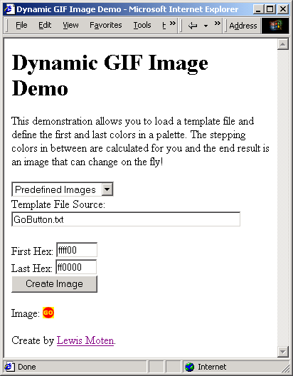

### [Hex Viewer](./HexViewer/README.md)

*4/30/2001 10:07:08 PM*

Allows you to view the binary data of any file (GIF, JPG, ZIP, TXT, HTM, ASP) as if you were looking at a common hex viewer. Bytes are displayed as Hex characters and character data is displayed on the right. Starting positions of each row are displayed on the left.

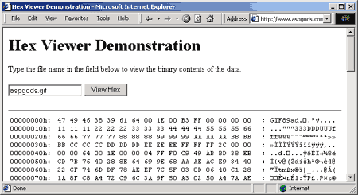

### [Read Image Dimensions](./ReadImageDimensions/README.md)

*5/2/2001 2:16:32 PM*

Allows you to read the width and height for GIF, JPEG (JPG/JFIF), Bitmap(BMP), and PNG files. You can upload a file or load a binary file from the server in the demonstration. This is great when you allow users to Upload files and need to ensure that they fit within a specific set of boundries (ie - uploading banners). Update - Now supports AVI, MOV, MPG/MPEG, and SWF with support from my brother Lucas Moten. JPEG files have also been fixed to read correctly.

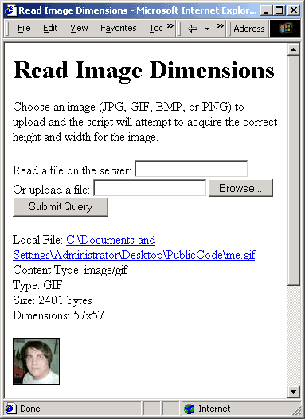

### [How to destroy a Shopping Cart](./HowToDestroyAShoppingCart/README.md)

*5/4/2001 10:31:03 AM*

I often get questions on how to deal with shopping cart data stored within the database that is no longer needed after the user has logged off. The answer is simple and deals with some database calls in the Global.ASA.

### [Parse Metadata from URLs](./ParseMetadataFromURLs/README.md)

*5/4/2001 2:09:54 PM*

This class demonstrates how you can request the HTML of a URL from another website using the XMLHTTP object to spider the web page. (Simular to the methods of the ASPHttp object). The data is parsed and made available through a class object. This code is great if you are thinking about creating a Search Engine - or you just want to verify that URLs exist that users may place in there profiles. Also handy for finding broken links. If your server has IE5, or XML objects from Microsoft installed on it, then you should be able to use this demonstration without any problems.

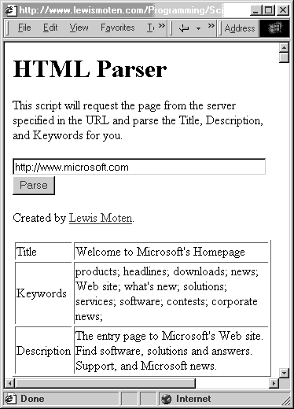

### [Advanced HTML Encoder](./AdvancedHTMLEncoder/README.md)

*5/5/2001 8:36:32 AM*

This code demonstrates how you can convert a string to HTML text format. It goes beyond the power of the Server.HTMLEncode method in that it parses out all HTML tags, changes new-line characters to "BR" tags, and also formats double-spacing and tabs.

### [Helpful Checkbox Functions](./HelpfulCheckboxFunctions/README.md)

*5/5/2001 2:27:46 PM*

Ok, I'm uploading something that is very simple this time - but this is one of the most used things that I have. These little functions help me make code smaller and change the wording to users viewing the text next to a check box. I find that if you change the words based on what the user has chosen, it feels a little more comfortable to them.

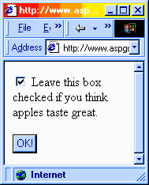

### [Small Pagination Navigation](./SmallPaginationNavigation/README.md)

*5/6/2001 4:02:44 PM*

I've coded many dynamic pages that needed the support of displaying data accross multiple pages. Whith this script, it will build a small navigation that you can display at the top and/or bottom of your results to navigate to the next page. It also supports the ability to only display pages within a specified range. (ie - if you have 1000 pages, it will only write links to 5 of the pages closest to the current page being viewed.)

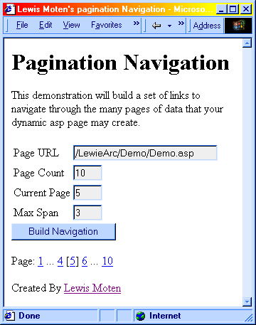

### [RC4 Encryption/Decryption](./RC4EncryptionDecryption/README.md)

*5/8/2001 2:01:12 AM*

Encrypts and Decrypts data using the RC4 algorithm and a Key/Password. Many thanks goes to many, many people on PSC and the internet for helping me through this. Sebastions code over at the Visual Basic section was a good start. This code runs quick in one function and is slightly commented. note - RSA patent expired in September 2000.

### [RC4 Class](./RC4Class/README.md)

*5/8/2001 9:52:48 AM*

Applys Encryption/Decryption to strings. I think just about everyone who has seen my code knows how I love classes. This version is more "cleaned up" and thrown into a nice little class for an object oriented feeling. (If only ASP was object oriented, I would be a happy camper). It is also a little more optimized to run quicker if you change the Key/Password often.

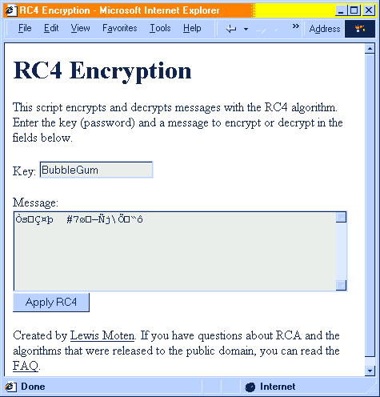

### [vbScript ColorCoder v2.0](./vbScriptColorCoderV2.0/README.md)

*5/8/2001 12:24:56 PM*

This script colorizes your vbScript for display on web pages. All colors can be managed through a style sheet. It seems that those who knew about the results of this version (from browsing my website) always kept asking me for the code and my old version that I refered them to was out-dated and didn't come close enough to there expectations. So peeps - I give to you my most proud and recent version of the color coder.

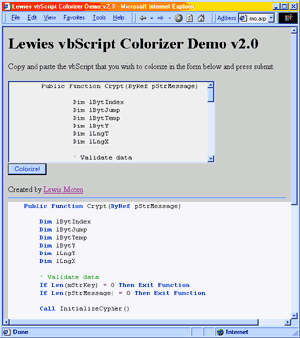

### [IsPrime](./IsPrime/README.md)

*5/9/2001 10:23:41 AM*

Checks to see if a number is a primary number. Prime numbers are commonly found in encryption schemes that use Public/Private keys.

### [RCA Encryption Class](./RCAEncryptionClass/README.md)

*5/9/2001 5:33:51 PM*

RCA is used for most standard public key/private key encryption techniques. Due to its burden on resources, RCA is generally used to encrypt random session keys wich are then used to encode messages with RC4. RCA also brings digital certificates into the picture. This, and many other "public" algorithms using RC4 do not truly make the message secure. Encryption is performed in 8 bit blocks - or 1 byte. Typing "AAAAAA", you will see a pattern begin for form with the encrypted data. If someone were to look at the results from encrypting each letter of the alphabet, your data would be compromized. Also, the public/private keys are limited between a range of 1 and about 65000. This is primarily a starting point if you want to enable a more secure encryption scheme, or you just want to learn more about it.

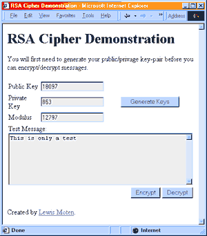

### [Whois Lookup with XMLHTTP](./WhoisLookupWithXMLHTTP/README.md)

*5/9/2001 7:18:18 PM*

Queries a WhoIs server for for domain information. Useful for people who want to sell domain names. This version uses the XMLHTTP component that is installed on most servers, so there is no additional need to install any extra COM objects.

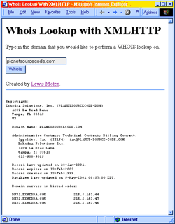

### [Allow users to post "Safe" HTML](./AllowUsersToPostSafeHTML/README.md)

*5/10/2001 9:11:02 AM*

This code pulls out all the nasty tags that a user sholdn't use when posting content. It also pulls out any javascript events assigned to any tags. A must have if you allow people to post HTML on your site.

### [Add E-Mail Job to SQL Server](./EmailJobForSQL/README.md)

*6/4/2001 5:19:22 PM*

This script helps start you off to learning how to automate some of your processes with SQL . For this example, I have chosen to send Email through SQL Server using vbScript. Messages are pulled from a table and deleted once they are sent. You need to create a table in the master database called "Email" and assign the fields "To", "From", "Subject" and "Body". The script will do the rest. If you "SA" account has a password, you will need to modify the script to relflect those changes.

### [Table Data Export](./TableDataExport/README.md)

*6/6/2001 3:39:36 PM*

Exports data from a database int Transact-SQL Batch files. Used primarily for exporting data from an access database to an SQL Server.

### [Lewies Coding Standards](./LewiesCodingStandards/README.md)

*6/7/2001 12:17:50 PM*

Peer into the brains of a professional programmer to learn how to become a better coder and more easily maintain your code for management and easily allow others to understand.

### [Membership Server v1.0](./MembershipServerv1.0/README.md)

*6/20/2001 11:02:43 AM*

Allows remote login validation of members against a centralized membership service via. ASP. (Simular to MS Passport)

### [Cookie Debugger](./CookieDebugger/README.md)

*6/21/2001 2:31:30 PM*

Creates a list of all cookies and there crumbs along with the values assigned to each one.

### [Form Data Debugger](./FormDataDebugger/README.md)

*6/21/2001 2:45:43 PM*

Reads posted form data and returns an HTML formatted display of field names and the values assigned to them.

### [Debug QueryString](./DebugQueryString/README.md)

*6/21/2001 2:55:50 PM*

Just used for debugging querystring data. Creates an orderd list of field names and the values assigned to each one.

### [Lewie's Image Gallery](./LewiesImageGallery/README.md)

*6/22/2001 2:44:41 AM*

Upload, Manage, and Display images within your own personal art gallery. This Image Bank was made for my girl friend so that she could easily add the images and change them on her own. It also offers categories. To administrate, goto admin.asp and type Administrator/Password to login. User accounts can be added and changed in the administration section. You can delete user accounts as long as 1 account will still remain. Images upload without COM.

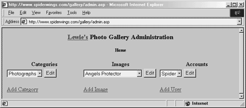

### [Lewies URLDecode](./LewiesURLDecode/README.md)

*6/22/2001 5:33:47 PM*

Xao Xiong originally posted his version of DecodeURL and asked for a reply for a better way. I replied, but it didn't turn out too well, so i'm posting it here for him to see. The approach i took is that when you look at an encoded URL string, 2 hex characters follow a percent sign. XAO listed a few to translate into actual characters, but he didn't account for all 256 of them. Check it out! See http://www.planetsourcecode.com/xq/ASP/ txtCodeId.6728/lngWId.4/qx/vb/scripts/ ShowCode.htm

### [Format string for Java](./FormatStringForJava/README.md)

*7/3/2001 10:51:35 AM*

formats a regular string to javascript. i.e. - changes ticks (') to proceed with a back slash (\').

### [Binary Data Manipulation](./BinaryDataManipulation/README.md)

*7/3/2001 1:54:31 PM*

These two functions allow you to convert between Unicode and Ascii strings. This is great if you are working with the Request.BinaryRead/BinaryWrite methods or binary data within a database.

### [Unlimited Alternating Colors](./UnlimitedAlternatingColors/README.md)

*7/13/2001 9:54:32 AM*

Demonstrates how to have alternating colors. Most people usually need just two alternating colors, but this method supports a larger list. Both a fixed loop and a conditional loop are provided as examples.

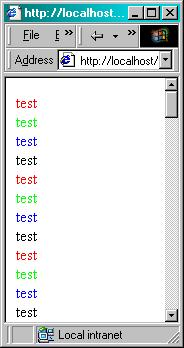

### [Catching Bogus Addresses](./CatchingBogusAddresses/README.md)

*7/25/2001 10:48:04 AM*

This article teaches how you can catch bogus email addresses before you register your members on your site. It also demonstrates how you can continue to verify the addresses over a period of time.

### [Hex/String Conversion](./HexStringConversion/README.md)

*7/25/2001 10:50:32 AM*

These functions allow you to easily convert a string to its hex value and back again.

### [Find Available File Name](./FindAvailableFileName/README.md)

*8/6/2001 12:42:36 AM*

When a user uploads a file, this function looks for duplicate file names. It incriments the file until an available name is provided and returns that name.

### [HTMLDecode](./HTMLDecode/README.md)

*8/6/2001 11:31:07 AM*

This function decodes HTML Encoded strings. I found that when some browsers post data, it converts double-byte characters to html encoded characters. This script searches for all numerical entities as well as a few popular named entities. You will need to tell the server and the web browser that you are working with Unicode characters. The code has been included for working with the UTF-7 character set. Enjoy!

### [HTML2Word](./HTML2Word/README.md)

*1/30/2002 4:44:40 PM*

Convert HTML web pages into Word documents. This is great for creating word documents on the fly. Can be used to email documents after finnished converting. This code is in various places on the web. I'm supprised I didn't find it on PSC. This is my own version for you to modify as you wish. Larger files take longer to process. My waiting period is not good! System resources will be pegged. Seems to have problems with Website URLs, but files on the same server don't give me as many problems.

### [Site Post Check](./SitePostCheck/README.md)

*2/14/2002 10:58:19 PM*

Checks the HTTP Referer header to ensure people are not posting from other websites. You can include this file if you use templates on your website, or just include it on the pages that receive form data posts. Warning - someone who knows there stuff can get around this by modifying there HOST file. this isn't 100% fool proof, but it may deter most from posting data from other websites.

### [ANSI to Unicode](./AnsiToUnicode/README.md)

*2/25/2002 12:08:12 PM*

Converts from ANSI to Unicode very fast. Inspired by code found in UltraFastAspUpload by Cakkie (on PSC). This should work slightly faster then Cakkies due to how some of the code has been arranged.

### [Color Wheel Picker](./ColorWheelPicker/README.md)

*2/27/2002 11:38:27 PM*

I was working on a scriptlet to allow users to choose a color. A color wheel is displayed with an assortment of colors - most of witch are web-safe. Clicking on a color causes it to be outlined and raise an event that a color was chosen. This object mimics one of the color-picker forms found in Microsoft Office 2000. This scriplet does not yet raise events or expose properties. The basics, however are available for you to be amazed.

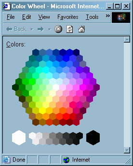

### [Color Picker (Fallout)](./ColorPicker(Fallout)/README.md)

*2/28/2002 10:35:56 PM*

Allow users to choose colors from familiar interfaces that are standard to the windows operating system. This one displays a wide range of hues in a color spectrum and fades the saturation. An additional scriptlet appears to change the luminance of each color chosen.

/screenshot.jpg)

### [Bottom Tabs](./BottomTabs/README.md)

*3/1/2002 7:44:12 PM*

Simulate the tab control found at the bottom of popular programs such as visual Interdev and Front Page.

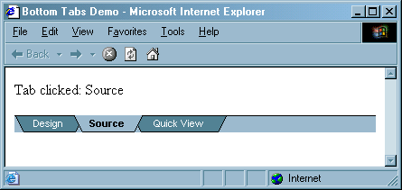

### [Spinner Scriptlet](./SpinnerScriptlet/README.md)

*3/2/2002 11:21:58 PM*

Simulates the spinner control found in visual basic on a web page. Author comments included.

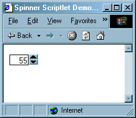

### [Expose Your Content](./ExposeYourContent/README.md)

*3/4/2002 1:39:30 PM*

Expose your content through external javascript source files.

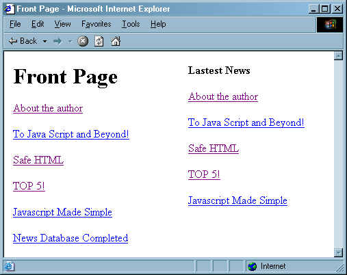

### [Gibberish Encoding](./GibberishEncoding/README.md)

*3/13/2002 9:37:00 PM*

Quick way to learn how to speak gibberish. It is sometimes known as "girl-speak".

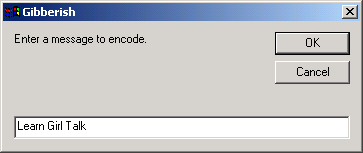

### [Folder Interface](./FolderInterface/README.md)

*3/16/2002 2:27:14 PM*

Give your users a nice clean interface to navigate, choose, and create new folders.

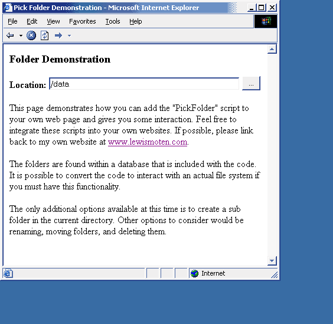

### [Forced Download](./ForcedDownload/README.md)

*3/18/2002 10:14:53 PM*

Forces users to have choice of downloading a binary file. This was becomming a problem with Word documents - as they would either open within the browser or open externally. You may need to change the FileName variable.

### [Oppisite Colour2 (HEX)](./OppisiteColour2(HEX)/README.md)

*3/19/2002 12:15:50 PM*

Grab the opposite 6 character HEX color. This sums up David Weirs Color invert script with just one line of code. See his original code at http://www.pscode.com/vb/scripts/showcode.asp?txtCodeId=7176 Be careful when comming close to middle gray scale (808080). opposites are same.

### [Upload Files Without COM v2](./UploadFilesWithoutCOMv2/README.md)

*3/20/2002 11:50:28 AM*

No need to purchase expensive components. You can do it all with what you already got. This version is an update for faster speed and reliability. Bugs have been fixed, and the entire code has been commented to walk you through the process.

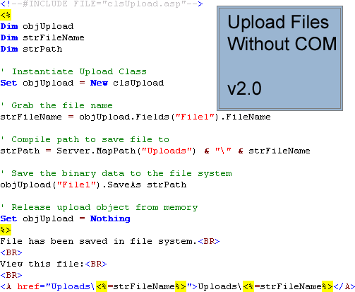

### [Universal Email Interface](./UniversalEmailInterface/README.md)

*3/20/2002 7:54:42 PM*

Lays down a universal interface to sending email. Easier to port to other servers that use different COM objects to send email. Even exposes a list of ProgID's that are installed on the server. (This is the beginnig. But I am sure you can see where the benefit of this code is going)

### [IIS Authentication](./IISAuthentication/README.md)

*3/21/2002 11:46:28 AM*

Requests users to login to website with NT Account.

### [ADODBTypeName](./ADODBTypeName/README.md)

*4/21/2002 8:52:45 PM*

Quickly find out the type of variables returned from your adodb recordset. TypeName() function doesn't do the trick. Databases offer additional data types. This script helps solve type problems without having to lookup the name of the numbers returned.

### [Display Accurate Time from NIST](./DisplayAccurateTimeFromNIST/README.md)

*5/4/2002 11:02:45 PM*

Display accurate time to your visitors! This script requests the UTC time from a server that is syncronized with an atomic clock. It then adjusts the time according to timezone and if daylight savings time is in effect.

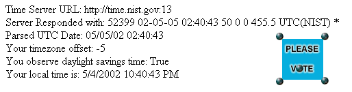

### [Image Directory Listing](./ImageDirectoryListing/README.md)

*5/6/2002 1:49:37 PM*

Lists thumbnail images within the current directory. Very simple beginner stuff dealing with file scripting object. Handy for viewing your images quickly. Just copy the code and paste it a file called default.asp. Then view the directory on your website.

### [Random Pronouncable Password](./RandomPronouncablePassword/README.md)

*5/14/2002 10:39:56 PM*

Create a random password that is pronouncable. This helps users remember the password easier and can come up with some silly words.

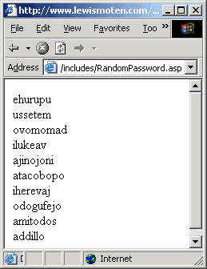

### [Contrasting Colors](./ContrastingColors/README.md)

*6/17/2002 11:15:48 PM*

Returns a color that is guarenteed to have contrast against the suggested color. Contrast to white is gray, contrast to light blue is dark blue, etc. Demo included.

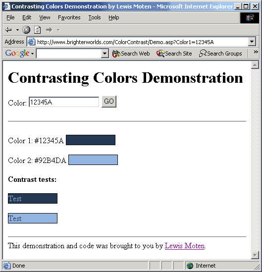

### [Calculate Color Fading](./CalculateColorFading/README.md)

*7/1/2002 10:59:56 PM*

Shows an example of how to fade from one color to another. This is a bare-bones example to help you get started with calculating a fade across 16 colors.

### [Zip File Viewer](./ZipFileViewer/README.md)

*7/5/2002 11:40:32 PM*

Display a list of files within a zip files archive along with the compressed/uncompressed size, ratio, path, etc. Always wanted to do this, but usually found code refering to winzip or some api calls. This is strait ASP. Performance is not at its best - this is a working concept. You can see the results in action on my website (www.lewismoten.com)

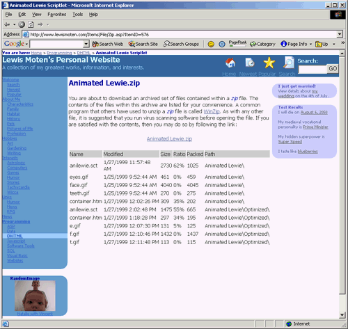

### [DOS Date/Time Functions](./DOSDateTimeFunctions/README.md)

*7/5/2002 11:54:59 PM*

DOS stores date and time with 4 bytes. 2 for date, 2 for time. These functions convert those bytes to appropriate vbScript date and time values. I used these within my WinZip file viewer scripts because winzip stored dates in this format.

### [Image Drop](./ImageDrop/README.md)

*7/6/2002 11:28:59 AM*

This script allows you to specify an image to fall down the entire height of the web browser. Images drop at random speeds. The number of images dropping may be specified as well. This particular script demonstrates how to drop an image related to the current month. This gives off an interesting effect.

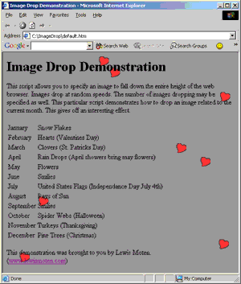

### [Switchbox Scriptlet](./SwitchboxScriptlet/README.md)

*7/6/2002 11:45:57 AM*

Add / Remove / Manage position of items on a list. This scriplet demonstrates how you can allow your users to pick up to 5 flavors of there best ice cream.

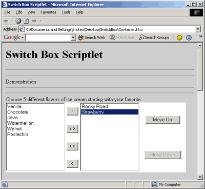

### [Web Navigation Scriptlet](./WebNavigationScriptlet/README.md)

*7/6/2002 12:05:19 PM*

Navigate through a website within a small area of the screen.

### [BreadCrumbs Navigation](./BreadCrumbsNavigation/README.md)

*7/8/2002 7:40:28 PM*

Displays a path to navigate through each subdirectory in the path to your web page. This is called bread crumb navigation. Many sites use this with the words You Are Here. It is suggested that you do not use this type of navigation alone.

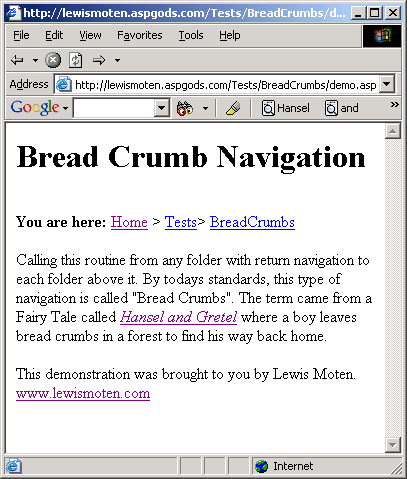

### [Deny Website Copiers](./DenyWebsiteCopiers/README.md)

*7/9/2002 1:29:41 AM*

Prevents web caching programs from accessing your website. Helps increase performance of your website against these programs that may cause DOS attacks on websites with slow internet connections - such as the upstream of a cable modem.

### [Report Navigation](./ReportNavigation/README.md)

*7/9/2002 1:59:31 AM*

Gives you an interface to navigate reports by year, quarter, month, week, or day. This is just the navigation alone that I append to the top of different reports.

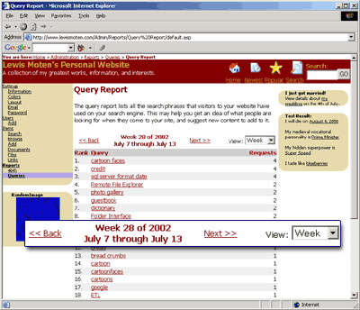

### [encrypt4.asp](./encrypt4/README.md)

*8/2/2002 10:39:53 AM*

Encrypts text using the enigma algotithm used in World War II. This security is easily breakable, but people seem to be using this. The next step is XOR encryption - which is also easily breakable. Use this only to get an idea behind how security algorithms have evolved over time and identify its weakenesses. This code is an improvement in clarity and support of characters such as NULLs to encrypt2.asp by Barry Beatti - http://www.planet-source-code.com/vb/scripts/ShowCode.asp?lngWId=4&txtCodeId=7211

### [vbScript ColorCoder v3.0](./vbScriptColorCoderV3.0/README.md)

*8/9/2002 9:28:33 PM*

Upgraded by popular demand for its third generation. Converts vbScript to HTML and colorizes it just like Visual Basic and InterDev. This version has more keywords, runs amazingly faster, and has been packaged into a class. This light weight component was made possible through the use of regular expressions. It returns HTML that is friendly to older browsers with limited use of style. Also offers ability to load a vbScript from the file system into memory. Enjoy!

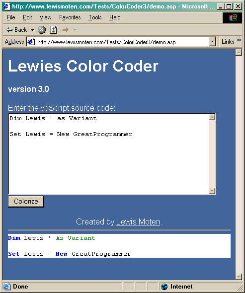

### [Parse Hex value of visitors System Colors](./ParseHexValueOfVisitorsSystemColors/README.md)

*8/13/2002 11:19:40 AM*

Parses the hex value of users system colors. Great for creating dynamic images on the fly to blend with the users operating system.

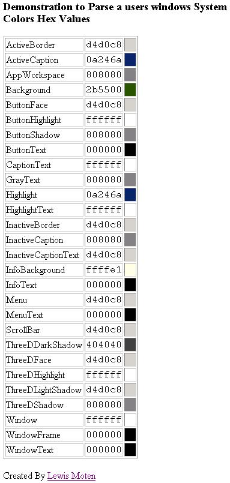

### [Dynamic Stylesheet Interaction](./DynamicStylesheetInteraction/README.md)

*9/2/2002 12:46:59 PM*

Interact with stylesheets to dynamically change properties.

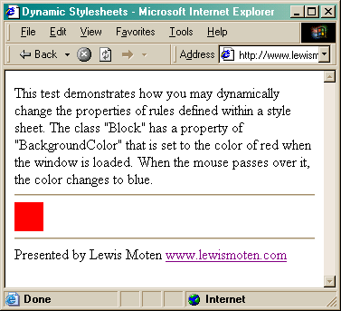

### [Upload Files Without COM v3](./UploadFilesWithoutCOMv3/README.md)

*9/1/2003 11:19:59 PM*

Allows you to upload multiple files and fields without purchasing or registering COM objects. Great for shared hosts that frown upon 3rd Party com objects or charge an arm and a leg for them. This script provides an object oriented interface using classes for easier development. The power that this script has over others is that it does not use dictionary objects to store the uploaded files. It also harnesses the power of ADODB to prepare and save binary data to the file system with quick speeds. This is the script that you have been looking for. You can get a really good feel for how the script is used just by reading through the FAQ and examples provided. This script has been tailored to meet the requests of developers who have used previouse versions. The code is comented very well and comes along with examples of how to do common operations, as well as a FAQ. Bugs from version 2 have been fixed, or otherwise throw exceptions to the user giving them details of how to correct the problem (such as giving permission to the internet user account). Memory is managed more efficiently in version 3 that allows for more scaleablity and larger files. By the request of a few developers, progress bars are now supported to notify the user how much information has been received by the server. A website for support has also been created where you can get help from the author, other users of the script, and get any recent revisions or additional examples as they become available.

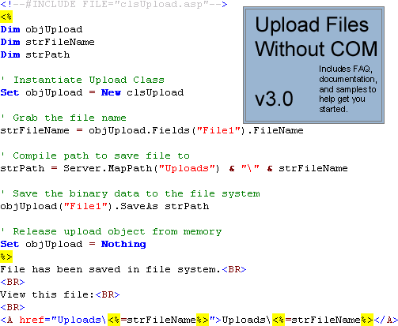

### [Forced Download 2](./ForcedDownload2/README.md)

*9/4/2003 11:07:34 AM*

Allows you to force a file to be downloaded rather then displayed within the users browser. This can be used with Word documents, Excel Spreadsheets, Adobe PDF's, and other files. Script has been optimized to support large downloads and be dynamically called to download any file (except ASP, ASPX, ASA, ASAX, MDB files). Also clears up some problems with currupt files users had been having by clearing all previouse content and headers.

### [Dynamic DNS Update IP Parser](./DynamicDNSUpdateIPParser/README.md)

*9/4/2003 1:52:03 PM*

Has ability to go out on the internet and determine what your current IP address is. Also allows you ability to update namecheap.com with your current IP address. Can be modified to use with other dynamic dns services. Thanks goes to Kenny for letting me know about this cheap DNS host!

### [StrConv Unicode/Ascii](./StrConvUnicodeAscii/README.md)

*9/4/2003 11:26:21 PM*

Converts between unicode and ANSI using ADODB Streams and recordsets. I was pressing myself to the limit to find a faster way to convert strings back and forth between unicode and ANSI during file uploads. This version goes the distance and has great speed.

### [Data Dictionary Report Generator](./DataDictionary/README.md)

*7/28/2004 10:12:34 PM*

Retrieves the structure of your data and displays it into a nice report that you can copy & paste into word documents. Works with SQL Server 2000. Also lists any comments within the database for tables & columns.

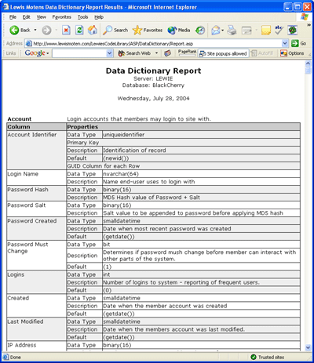

### [Lewies Seti Stats](./LewiesSetiStats/README.md)

*7/29/2004 12:14:57 AM*

Reads an Xml file from the Seti@Home projects web servers and allows you to display the information on your own website. Cache xml files for up to 8 hours and loads via. javascript. Compatible with Netscape, Mozilla, FireFox, and MSIE.

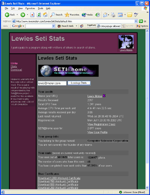

