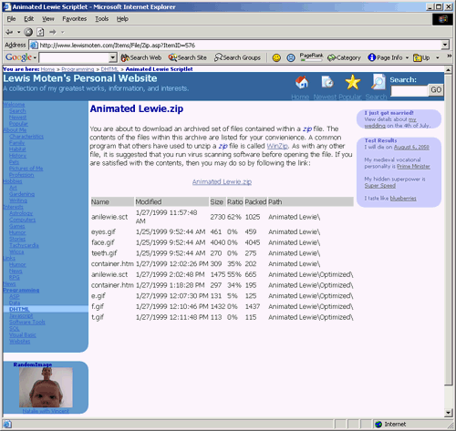

# [Lewie's Code Library PSC](../../README.md)

Open source projects that I had published to Planet Source Code.

## [Classic ASP / vbScript](../README.md)

### Zip File Viewer

*7/5/2002 11:40:32 PM*

Display a list of files within a zip files archive along with the compressed/uncompressed size, ratio, path, etc. Always wanted to do this, but usually found code refering to winzip or some api calls. This is strait ASP. Performance is not at its best - this is a working concept. You can see the results in action on my website (www.lewismoten.com)

