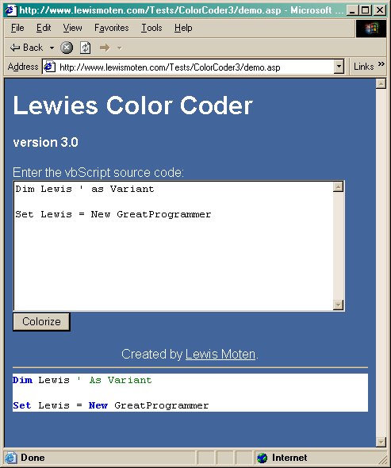

# [Lewie's Code Library PSC](../../README.md)

Open source projects that I had published to Planet Source Code.

## [Classic ASP / vbScript](../README.md)

### vbScript ColorCoder v3.0

*8/9/2002 9:28:33 PM*

Upgraded by popular demand for its third generation. Converts vbScript to HTML and colorizes it just like Visual Basic and InterDev. This version has more keywords, runs amazingly faster, and has been packaged into a class. This light weight component was made possible through the use of regular expressions. It returns HTML that is friendly to older browsers with limited use of style. Also offers ability to load a vbScript from the file system into memory. Enjoy!

