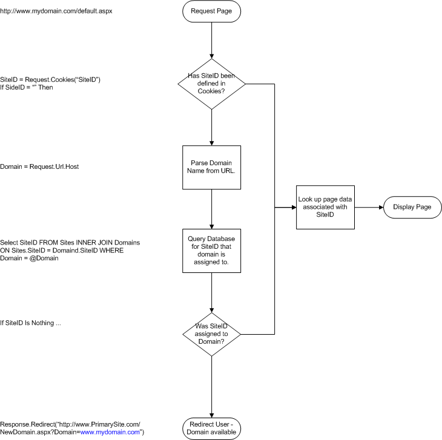
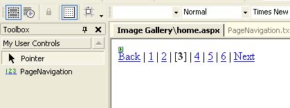
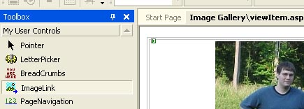
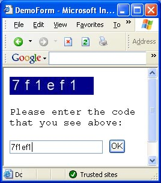
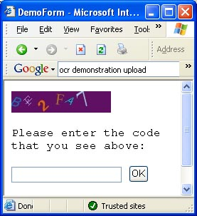

# [Lewie's Code Library PSC](../README.md)

Open source projects that I had published to Planet Source Code.

## ASP.Net

### [HTTP Formatting](./HTTPFormatting/README.md)

*12/3/2002 2:13:12 PM*

Formats HTML source code to prevent users from using scripts and unwanted formatting tags such as Cascading style sheets, ActiveX controls, java applets, etc.

### [Dynamic Domain Hosting](./DynamicDomainHosting/README.md)

*3/28/2003 12:40:15 AM*

Shows how you can host multiple domains under one IP address by mapping domain names to sites within a database.

### [Dynamic ScriptMapping with Metabase](./DynamicScriptMappingWithMetabase/README.md)

*9/20/2003 9:43:23 AM*

Allows you to assign almost any extension to be processed by the ASPX script processor. You may add, update, and remove the extension progromatically without opening the IIS Manager. Great for those of you who do not have access to the machines desktop (such as hosted at other ISPs).

### [Page Navigation WebControl](./PageNavigationWebControl/README.md)

*10/11/2003 1:12:51 AM*

Allows users to navigate through each page (kinda like Google). They can click back, next, and page numbers as well. You can customize its output html through design-time. Great for beginners learning how to code web controls.

### [Thumbnail](./Thumbnail/README.md)

*10/16/2003 12:55:56 AM*

allows you to dynamically create thumbnails of your images on the fly. Image is resized to its aspect ration to fit within a defined region. You can specify quality of image to reduce bandwidth, and background color to fill in whitespace around image.

### [ImageLink WebControl](./ImageLinkWebControl/README.md)

*10/17/2003 1:04:35 AM*

Functions just like the image control except that you may also provide a navigation url. when the user clicks the image, they go off to the url you specify.

### [Lewies Validation Code Image - Part 1](./ValidationCodeImage1/README.md)

*10/23/2003 1:55:30 AM*

Prevent content and processes from being misused for spam or inappropriate use. An image is displayed to the end-user. An attempt is made to prevent OCR recognition by agents, spiders, or artificial intelligence to gain access to content or processes. The image will display a “code” to the user that they are required to enter into a field provided.

### [Lewies Validation Code Image - Part 2](./ValidationCodeImage2/README.md)

*10/24/2003 1:13:58 AM*

Prevent content and processes from being misused for spam or inappropriate use. An image is displayed to the end-user. An attempt is made to prevent OCR recognition by agents, spiders, or artificial intelligence to gain access to content or processes. The image will display a “code” to the user that they are required to enter into a field provided.

