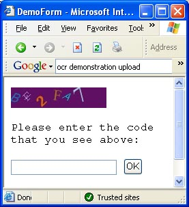

# [Lewie's Code Library PSC](../../README.md)

Open source projects that I had published to Planet Source Code.

## [ASP.Net](../README.md)

### Lewies Validation Code Image - Part 2

*10/24/2003 1:13:58 AM*

Prevent content and processes from being misused for spam or inappropriate use. An image is displayed to the end-user. An attempt is made to prevent OCR recognition by agents, spiders, or artificial intelligence to gain access to content or processes. The image will display a “code” to the user that they are required to enter into a field provided.

