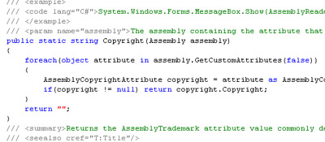
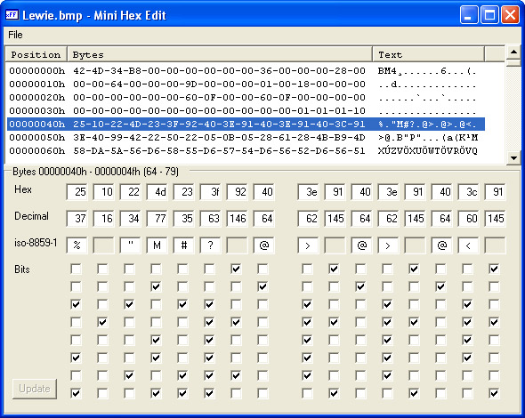
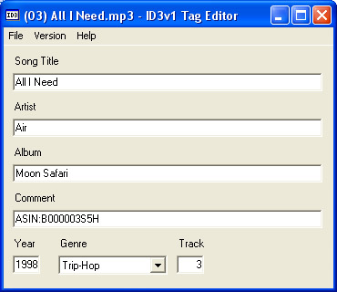
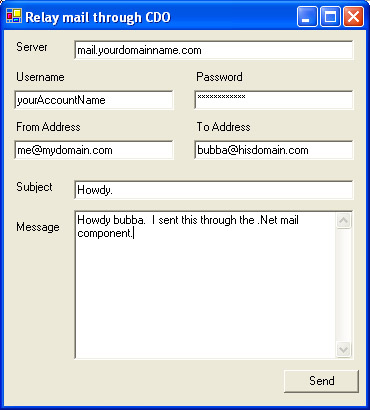
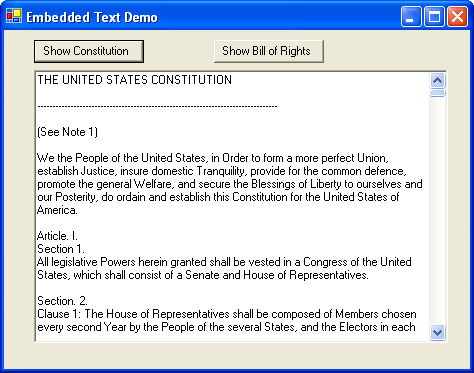
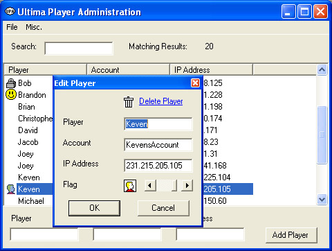

# [Lewie's Code Library PSC](../README.md)

Open source projects that I had published to Planet Source Code.

## C#

### [AssemblyReader](./AssemblyReader)

*6/19/2004 1:26:38 AM*

The assembly reader reads embedded resources as streams from any assembly you may pass to it. By default, it will read from the executing assembly. You can also read the assemblies title, description, configuration, company, product, copyright, trademark, and culture attributes.

### [Lewies Mini Hex Editor](./MiniHexEdit)

*8/1/2004 12:00:20 AM*

This small utility aids programmers into viewing and editing the data within binary files. Works with large files very nicely. Enter either the hex, decimal, or text value of each byte. You can also edit bits. I use programs like these when learning how to read file structures such as MP3, GIF, and JPG files. Also comes with a handy setup project for easy installation.

### [Lewies ID3v1.1 Tag Editor](./ID3v1TagEditor)

*8/1/2004 11:15:00 AM*

This program can edit MP3 files to include the Song Title, Album, Artist, Year, Genre, Track Number and comments about the music.

### [Relay email through CDO ](./CdoMailRelay)

*8/2/2004 9:20:31 PM*

Send email through the CDO objects that .Net interfaces with. Now you can choose your ISP's mail server and log in with username/password to relay mail to the outside world.

### [Lewies RSA Encryption Example](./RsaExample)

*8/3/2004 10:35:10 PM*

Create new key pairs for asymmetric encryption or copy/paste strings into text fields provided. Encrypts and decrypts text to encrypted base64 strings. Main benefit here is I got around a problem with where the key was stored and can now load keys on the fly. Asymmetric keys are usually used to encrypt Session Keys and Digital Signatures. Session Keys are used with Symmetric Encryption on the Message itself because it is much faster then Assymetric encryption. This is great for anyone beginning to learn about Security or how to Implement RSA Public Key / Private Key Infrastructure.

### [Get Embedded Text Files](./EmbeddedText)

*8/5/2004 11:55:55 PM*

Load an embedded text from from within your assembly and assign it to a variable. I primarily use this when storing sql, data, or some pieces of code that I need to have access to. Simply add text files to your solution and change the "Build Action" property to "Embedded Resource" on each one. No need to distribute extra files with your programs - they get compiled as resources inside executables and DLLs.

### [Ultima Player Administration](./PlayerAdmin)

*8/8/2004 12:43:11 AM*

Maintain a list of player names, accounts, IP addresses, and assign flags. Search, Edit, Delete, Export, Import. This little utility was made at the request of my wife who is an administrator on an Ultima emulator shard. Greate for beginners wanting to learn how to do some of the basics.

