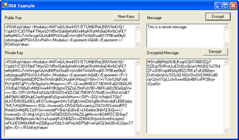

# [Lewie's Code Library PSC](../../README.md)

Open source projects that I had published to Planet Source Code.

## [C#](../README.md)

### Lewies RSA Encryption Example

*8/3/2004 10:35:10 PM*

Create new key pairs for asymmetric encryption or copy/paste strings into text fields provided. Encrypts and decrypts text to encrypted base64 strings. Main benefit here is I got around a problem with where the key was stored and can now load keys on the fly. Asymmetric keys are usually used to encrypt Session Keys and Digital Signatures. Session Keys are used with Symmetric Encryption on the Message itself because it is much faster then Assymetric encryption. This is great for anyone beginning to learn about Security or how to Implement RSA Public Key / Private Key Infrastructure.

