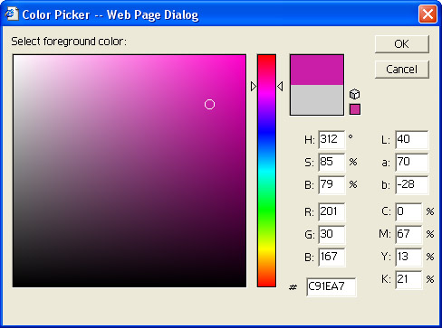

# [Lewie's Code Library PSC](../../README.md)

Open source projects that I had published to Planet Source Code.

## [JavaScript](../README.md)

### Lewies Color Picker

*5/16/2004 12:04:43 PM*

Let your users choose a color through a rich user interface. This color picker looks simular to Adobe Photoshop.

