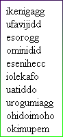
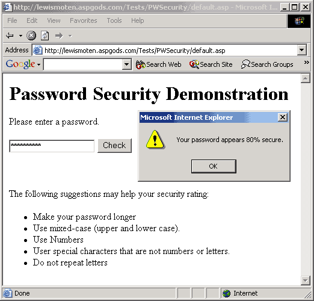
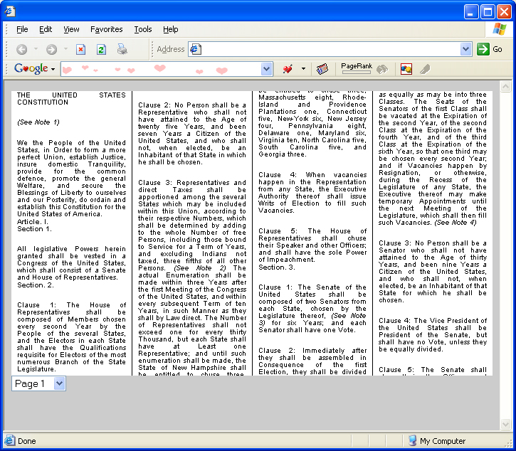
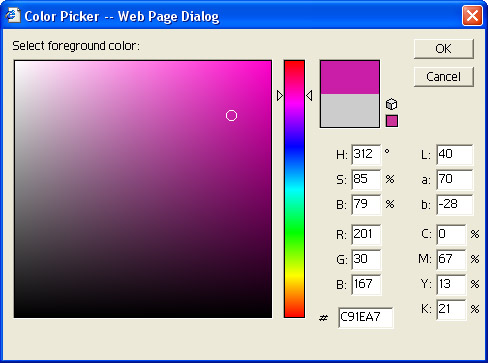
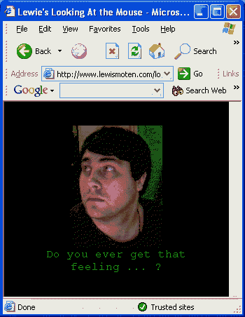
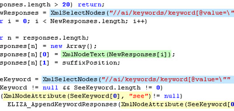
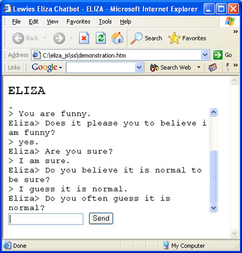

# Lewies-Code-Library-PSC

## JavaScript

Open source projects that I had published to Planet Source Code.

## [Hide Basic Authentication with HMTL Forms](./HideBasicAuthenticationWithHMTLForms)

*2/17/2001 12:09:30 AM*

I figured out how to let my users login with a form rather then using the built in dialog for basic authentication. Only problem is, if they get the username/password wrong, then they will still get that built in dialog. Code has been attatched for anyone who could use it. Very much a barebones demonstration. Works with any form of Basic Authentication (IIS / AuthentiX). Doesn't depend on any specific form of Scripting language on the server. works with cold fusion, perl, asp, etc. Tested with Netscape 3.04, 5, and Internet Explorer 5.5

## [Make Absolute URL](./MakeAbsoluteURL)

*2/17/2001 2:48:32 PM*

Converts a relevent url to an absolute URL. login.asp would become http://www.yourdomain.com/your/directory/structure/login.asp

## [Secure Hash Algorithm (SHA-1)](./SecureHashAlgorithm(SHA-1))

*4/13/2001 8:32:40 PM*

The function generates a 160-bit (40-hex-digits representing 20 bytes) message digest for a given message (String) of any length. The digest is unique to the message. It is not possible to recover the message from the digest. The only way to find the source message for a digest is by the brute force hashing of all possible messages and comparison of their digests.

## [Decimal to Hex](./DecimalToHex)

*4/29/2001 7:29:50 AM*

Converts a decimal number to a Hex String (i.e. 255 = 'FF')

## [Center Popup Windows](./CenterPopupWindows)

*2/6/2002 10:50:09 AM*

Center popup windows in the middle of your browser.

## [Request_QueryString](./Request_QueryString)

*4/21/2002 1:16:40 PM*

Allows browser to read querystring variables through javascript.

## [Random Pronouncable Password](./RandomPronouncablePassword)

*4/28/2002 5:50:02 PM*

Allows client browser to randomly create a pronouncable password. This can be used to suggest a password to the user that is easy to remember.

## [Request_Cookies](./Request_Cookies)

*5/4/2002 3:54:54 PM*

Gives ASP programmers a familliar interface to request cookies. document.write(Request.Cookies("UserName"))

## [Password Security](./PasswordSecurity)

*6/29/2002 5:00:50 PM*

Parses the password field and comes back with a percentage of how secure your password is against a hack attempt.

## [inverse color](./InverseColor)

*8/31/2003 12:19:28 AM*

returns inverse color of hex string passed to it. If you pass white, it will pass black back to you. If you pass red, it passes cyan back.

## [Columnizer](./Columnizer)

*2/14/2004 9:23:55 PM*

Display content in columns like a news paper. Also allows you to choose what page you want to see.

## [RandomInt](./RandomInt)

*2/27/2004 8:12:43 PM*

JavaScript 101: Pass two numbers and the method will return a random number between the two of them. I use this when displaying random content on a site.

## [Lewies Color Picker](./LewiesColorPicker)

*5/16/2004 12:04:43 PM*

Let your users choose a color through a rich user interface. This color picker looks simular to Adobe Photoshop.

## [Mouse Looker](./MouseLooker)

*6/5/2004 2:19:13 AM*

Take 9 pictures of yourself looking in 9 directions and assemble them to look at the users mouse depending on its location relative to your image. My wife thinks it's funny because she asks for money and drags the mouse above and below the image a few times so that I nod "yes".

## [Cross Browser XmlHelper](./CrossBrowserXmlHelper)

*6/15/2004 11:54:54 PM*

Allows you to easily load xml files in MSIE, Netscape, and Mozilla. Read nodes with xpath, select attribute values and text - all with the same interfaces.

## [GetSetCookie](./GetSetCookie)

*7/31/2004 12:10:01 AM*

Quick example allowing you to get and save cookies.

## [Lewies Eliza Chatbot](./ElizaChatbot)

*8/1/2004 10:59:12 PM*

This chatbot is written in JavaScript and loads its data from Xml files. The xml file should be easy enough to understand and minipulate to make your own variation of the ELIZA chatbot.

