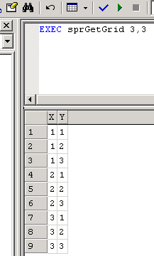

# [Lewie's Code Library PSC](../../README.md)

Open source projects that I had published to Planet Source Code.

## [SQL](../README.md)

### Creating Grids

*6/15/2002 10:25:39 AM*

Explains how to create grids and walks through the process of optimizing the query for speed. Grid table is populated with rows containing columns of X and Y.

