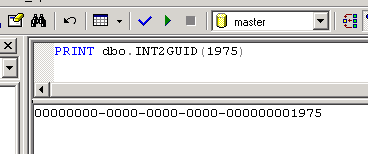

# [Lewie's Code Library PSC](../../README.md)

Open source projects that I had published to Planet Source Code.

## [SQL](../README.md)

### Int2GUID

*5/24/2002 6:08:45 PM*

Datatype conversion to change integers to unique identifier datatypes. This method is most useful when upgrading database schemas from using integers to using guids. You will still be able to "read" values by eye to match old Integers with the new GUIDs.

