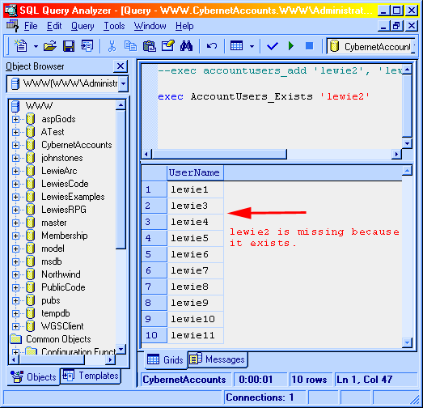
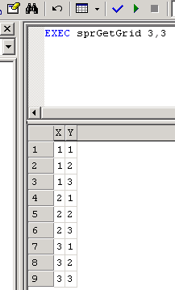

# [Lewie's Code Library PSC](../README.md)

Open source projects that I had published to Planet Source Code.

## SQL

### [sp_ZipCode_Distance](./sp_ZipCode_Distance/README.md)

*12/2/2000 6:07:15 PM*

This code looks up 2 zip codes latitude and longitude and determines the distance between the two in miles.

### [sp_ZipCode_Range](./sp_ZipCode_Range/README.md)

*12/2/2000 6:24:10 PM*

Returns all zip codes within a specified range of a specific zip code.

### [sp_Base64EncodeStr](./sp_Base64EncodeStr/README.md)

*12/2/2000 6:32:41 PM*

This procedure demonstrates how to instantiate an OLE object. I have used an ActiveX dll called AspConv™ (provided in AspLib™) to encode text with Base64 encoding in this example. The object must be registered on THE DATABASE SERVER (not to be confused with the web server/client/ or application server)

### [Suggest Available Usernames](./SuggestAvailableUsernames/README.md)

*7/7/2001 12:14:46 PM*

Procedure created in order to determine if a duplicate user name exists during a sign up process. If a user name does not exist, an empty recordset is returned. Otherwise, any digits found at the end of the username are trimmed, and new usernames that do not yet exist are suggested with a suffix of numbers appended to the end.

### [Random Pronouncable Password](./RandomPronouncablePassword/README.md)

*7/7/2001 1:49:34 PM*

Procedure made in order to create a random password that is somewhat pronouncable and easy to remember.

### [Trim](./Trim/README.md)

*10/15/2001 5:51:45 PM*

Allows you to Trim your strings when querying tables. I'm tired of using the Trim function in my ASP pages and Visual Basic. I created this little feature to trim away within SQL Server itself. This is a User Defined function rather then a stored procedure, so you can use it rite inside your select statements. "SELECT Trim([FirstName]) FROM [Users]". Sometimes you may find that you need to prefix the function with the owner - "SELECT dbo.Trim([FirstName]) FROM [Users]". Within the SQL Server Enterprise manager you will need to expand the "Databases" node. Locate your database and expand the node. Next, find the User Defined Functions node. Right-Mouse-Click and choose "New User Defined Function ...". Paste my code into it.

### [Find and remove Dupes](./FindAndRemoveDupes/README.md)

*2/8/2002 11:39:32 AM*

Find and remove duplicate values within a table.

### [Batch Change Object Owner](./BatchChangeObjectOwner/README.md)

*2/14/2002 10:50:47 PM*

demonstrates how to use a cursor to change all db objects to DBO as the owner.

### [Grant Public Execute Rites](./GrantPublicExecuteRites/README.md)

*2/14/2002 10:52:16 PM*

Grants execute rites on all stored procedures to the public. can be modified to grant to other users.

### [Count Matches](./CountMatches/README.md)

*2/22/2002 1:31:50 PM*

Allows you to count how many times a string appears within another string. example - count carriage returns within text. Handles up to 8K characters. Tricks can get around 8K limit for large text fields.

### [User Defined Function Intro](./UserDefinedFunctionIntro/README.md)

*3/3/2002 12:17:36 AM*

Brief introduction to user defined functions with examples and benefits explained.

### [Month/Year function](./MonthYearFunction/README.md)

*3/14/2002 3:32:02 PM*

Returns a date formated as "Mmm YYYY" (Ex. Oct 2002). Not anything ground breaking ...

### [First day of month](./FirstDayOfMonth/README.md)

*3/14/2002 3:43:33 PM*

Pass a date to the function and it will return the first day of the month. Example - print dbo.firstday('9/2/2002 3:57:31 PM') will print 'Sep 1 2002 12:00 AM'

### [Last Day of month](./LastDayOfMonth/README.md)

*3/14/2002 3:48:45 PM*

Returns last day, hour, minute, second of date passed to it. Example - print dbo.lastday('9/2/2002 3:57:31 PM') would return 'Sep 30 2002 11:59PM'. This function depends on dbo.FirstDay() located on PSC under First day of month

### [Month Range Table](./MonthRangeTable/README.md)

*3/14/2002 3:55:00 PM*

Build a table and populate it with dates between a specified range. I often use this method to create a set of months available, then use a left outer join to add any existing data within an actual table.

### [Newbie Line Seperators](./NewbieLineSeperators/README.md)

*4/1/2002 2:52:30 PM*

Simple way to insert a carriage return + line feed into a string. Really beginner stuff ... I keep forgetting sometimes. Rather spend time looking it up in the docs or old code, I'm putting it here to access it quicker. Hopefully someone else may also find it helpful.

### [Log Record Changes](./LogRecordChanges/README.md)

*5/14/2002 4:28:15 PM*

Make a copy of records within a table each time it is updated or a new record is created. This is very basic stuff. I'll be working on an update to handle primary keys and such.

### [FormatDate](./FormatDate/README.md)

*5/22/2002 4:35:10 PM*

Dynamically convert a date to a user-defined format.

### [Int2GUID](./Int2GUID/README.md)

*5/24/2002 6:08:45 PM*

Datatype conversion to change integers to unique identifier datatypes. This method is most useful when upgrading database schemas from using integers to using guids. You will still be able to "read" values by eye to match old Integers with the new GUIDs.

### [Num2Guid Conversion Function](./Num2GuidConversionFunction/README.md)

*5/24/2002 7:23:12 PM*

Article describing how to convert a decimal to a guid format. Also goes into detail explaining how to convert to other base-N numbers such as a bitmask/binary, octet, trinary, hex, and more. Introduces the benefit of functions with a real-case scenario.

### [Toggle Table Relations](./ToggleTableRelations/README.md)

*5/29/2002 9:43:53 AM*

Useful for disabling constraints during database replication. When copying data to another database, use this procedure on the target database first. When finnished, run it again to enable the constraints. I used this because I was working on a database with tables referencing themselves. I couldn't add records when previouse records did not exist. This solved the problem.

### [Toggle Bit Function](./ToggleBitFunction/README.md)

*6/3/2002 2:22:45 PM*

Toggle bit fields with a small line of code.

### [Creating Grids](./CreatingGrids/README.md)

*6/15/2002 10:25:39 AM*

Explains how to create grids and walks through the process of optimizing the query for speed. Grid table is populated with rows containing columns of X and Y.

### [ValidFilename](./ValidFilename/README.md)

*6/22/2002 11:20:36 AM*

Validates if the text proveded is a valid file name for windows. Useful in T-SQL statements validation before adding records.

### [IsAlphaNumeric](./IsAlphaNumeric/README.md)

*6/22/2002 11:33:02 AM*

Validates if the string provided contains only letters and numbers.

### [Validate Email](./ValidateEmail/README.md)

*6/22/2002 11:52:09 AM*

Validates an email address. Does not verify email address exists.

### [sprSearchTable](./sprSearchTable/README.md)

*7/11/2002 9:54:43 PM*

This procedure searches all columns within the table specified. All columns are casted as varchar(1000). If any of the columns contain the query, then all columns are returned. (SQL2K)

### [GrantUserExecuteAll](./GrantUserExecuteAll/README.md)

*11/8/2002 1:10:38 *

Allows you to specify a username and grant access to execute all SQL stored procedures within the current database. Very useful for developers that create databases with one account, but have programs accessing them through a seperate user account. This is an update to an old piece of code I had on PSC that limited to the public account.

### [OutlineSort '3.2.10.2'](./OutlineSort/README.md)

*12/3/2002 4:03:40 PM*

This function pads each number found within each decimal to allow sorting on outline numbers. Fixes problems where 2 comes after 10 in string sorts. An example of how this function is used would appear like this: SELECT OutlineNumber FROM Outline ORDER BY dbo.OutlineSort(OutlineNumber)

### [US Government Holidays](./USGovernmentHolidays/README.md)

*7/10/2003 3:56:17 PM*

Provide a date to this function and it will move it to the next US Government Business day - taking holidays into effect. US Government holidays are New Years Day, Birthday of Martin Luther King, Jr., Washington's Birthday, Memorial Day, Independence Day, Labor Day, Columbus Day, Veterans Day, Thanksgiving, and Christmas. Functions provided may be used for other special days as well.

### [Parse File Extensions](./ParseFileExtensions/README.md)

*7/27/2004 8:07:24 PM*

Parse file extensions with SQL

### [sprDataDictionary](./sprDataDictionary/README.md)

*7/28/2004 10:26:26 PM*

Goes through information schemas and extended properties to get each table, column, data type, comments, foreign keys, primary keys, constraints, and indexes. This information can then be used to create a data dictionary report in real time. Shows how to get MS_Description property through ::fn_listextendedproperty for columns and tables.

