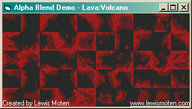

# [Lewie's Code Library PSC](../../README.md)

Open source projects that I had published to Planet Source Code.

## [Visual Basic](../README.md)

### Alpha Blend Utility

*8/27/2002 9:18:01 PM*

Blends one image into another image with the opacity based on an alpha channel image provided. Useful for developing tile chipsets for RPG games. Coastal tile chipset provided with 9 sample base tiles for demonstration purpose only - nothing fancy.

