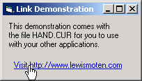

# [Lewie's Code Library PSC](../../README.md)

Open source projects that I had published to Planet Source Code.

## [Visual Basic](../README.md)

### Hyperlink with Hand Icon

*6/4/2002 9:01:22 PM*

Includes demonstration of how to make labels appear as hyperlinks, open the users default web browser, and uses a hand cursor when hovering over the icon. The hand.cur file is loaded seperately so that you may incorporate it into your other applications.

