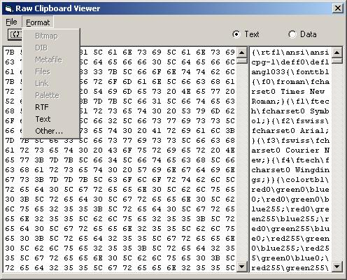

# [Lewie's Code Library PSC](../README.md)

Open source projects that I had published to Planet Source Code.

## Visual Basic

### [Color Utility](./ColorUtility/README.md)

*7/23/2000 5:25:39 PM*

This utility is used to find a color and determin its hex, long, and rgb values. it will also give you the name of the color if it matches one of the pre-defined colors recognized by browsers and determine if the color is "safe". An additional utility is included to load a picture and determine the color of any pixel used to create the picture.

### [Binary Convert](./BinaryConvert/README.md)

*7/29/2000 4:24:14 PM*

I always thought 0's and 1's were cool as a background to web pages or in the credits to the movie "Ghost in the Shell". I found a way to actually make your binary numbers mean something instead of trying to make a lot of random binary numbers on your own. This program looks as the Ascii value (0 - 255) of a character and determines an 8 digit binary number that the number equals to in binary language. It also converts binary language back into strings so you can send binary messages to and from your friends if your really up for it. Take note - A binary text message will be 8 times larger then a regular message. Download: This zip file comes with the executable and the source code. Hopefully it is all self explanitory. This is only the executable itself and does not include the run time dll's. You may need to download a visual basic 6.0 virtual machine.

### [PageRange](./PageRange/README.md)

*12/2/2000 5:39:20 PM*

I had database searches that were returning way too many pages to display an option to view each page. What I did was set up this procedure to return a range of pages, and also options to jump ahead, back, first page, last page, previouse page, and/or the next page. This routine tells you what those links are.

### [BitsToNum/NumToBits](./BitsToNumNumToBits/README.md)

*1/12/2001 12:24:50 AM*

I was reading some binary files and needed some routines to convert numbers back and forth into binary numbers. In this case, I set the procedures to work with binary arrays.

### [ByteString](./ByteString/README.md)

*1/12/2001 11:18:02 PM*

Returns a string of the Bit Representation of your Bytes or numbers composed of more then 1 byte. I use this to "peer inside" my bytes. It helps me with debugging when reading binary files.

### [Left Shift and Right Shift](./LeftRightShift/README.md)

*1/12/2001 11:21:31 PM*

Allows you to "Shift" bits around. These functions mimic the bitwise opperators << and >> in C.

### [Convert 16 bit colors to 24 bit](./Color16To24/README.md)

*1/12/2001 11:30:38 PM*

I was working with some files from a game and the colors were in 16 bit. I had to convert them to 24 bit just so that I could view them. These functions do just that.

### [ASP Whois Component with sample code](./WhoisComponent/README.md)

*2/18/2001 7:25:05 PM*

I was searching on the 'net for a whois COM object and everyone is charging $20 - $250 for a very simple object. I was a little low on cash and had the day off. This COM object includes ASP code and a list of over 250 whois databases on the net.

### [DoEvents Demonstration](./DoEventsDemo/README.md)

*2/19/2001 7:44:42 PM*

The main point here is to show beginners how to allow your code to "wait" for other events to take place before continuing to execute any code that follows. It also includes a timeout feature in case the event never raises a flag that it is finnished.

### [Simple Log Routine](./SimpleLogRoutine/README.md)

*6/1/2001 12:11:47 PM*

Simple routine that logs a sting to a specified log file. also supports word-wrapping on long lines (more then 80 characters) and inserts an empty line before and after the information so it is easier to read. This code is mainly here for my own personal reference.

### [Load a Text File](./LoadATextFile/README.md)

*6/14/2001 10:21:32 AM*

Very Simple (beginners code) - reads and returns the contents of a text file.

### [Dynamic Intrinsic Controls](./DynamicIntrinsicControls/README.md)

*6/21/2001 6:28:09 PM*

This demo shows you how to dynamically create a FileListBox control via vb Code rather then at design time. The reason I choose to create this was that I needed to get a list of files within a directory via. a DLL. The file system object causes too much overhead and this little trick makes the code run much faster. For testing purposes, just create a new EXE and throw this onto Form1. For more info, See the MS Knowledge Base: Q190670

### [Determine if File Is Old](./FileIsOld/README.md)

*6/22/2001 10:08:01 AM*

Determines if a file is old. I use this when I loop through the files in a "temp" directory to determine if I should delete old files on a website. Take note - the function looks at the last modified date rather then the date created.

### [Lewie's Hangman](./LewiesHangman/README.md)

*7/16/2001 3:39:22 PM*

So why is my version of hang man so cool? well - I don't know. I havn't looked at the others. This one lets you build your own list and "click" your way through the came. Click on each letter and it will be filled in (or a new piece of the hang man will be drawn.) Each game gets 6 wrong answers. You may also guess the phrase.

### [XOR Encryption Class](./XOREncryptionClass/README.md)

*3/2/2002 10:48:35 AM*

Encrypts and Decrypts messages using the XOR algorithm with support of unicode & method of getting pas the NULL barrier by converting messages to hex strings.

### [Get Logon User Name](./GetLogonUserName/README.md)

*3/8/2002 9:57:46 AM*

Reads the logon name of the current user. Tested with NT. Win95 appears to work as long as a user logs into the computer.

### [SQL Formatting](./SQLFormatting/README.md)

*3/15/2002 1:15:48 PM*

Format variables for SQL Syntax.

### [ParseNumber](./ParseNumber/README.md)

*3/15/2002 1:17:49 PM*

Parses a number from a string. Handles parans for negative numbers.

### [Remove Item Confirmation](./RemoveItemConfirmation/README.md)

*3/15/2002 1:28:24 PM*

Prompt your users if they wish to remove an item.

### [Raw Clipboard Viewer](./RawClipboardViewer/README.md)

*3/19/2002 4:21:13 PM*

Working on a clip-board spy to understand how data is saved within the clipboard. Still cleaning up a few things - but it works for the most part.

### [HTML2Word dll](./HTML2Word/README.md)

*3/21/2002 3:13:44 PM*

Converts a web page to a word document.

### [MakePath](./MakePath/README.md)

*4/30/2002 11:29:35 AM*

Creates folders and subfolders to the specified path.

### [Embed Binary Files In Programs](./EmbededFiles/README.md)

*5/22/2002 1:23:44 PM*

Embed binary files within your programs to be written out to the file system once the program runs. This demonstration creates a Word document.

### [Text to String Conversion](./TextToStringConversion/README.md)

*5/22/2002 3:19:53 PM*

Definately been done before. Just couldn't find specifially what I wanted. Converts text to strings in VBScript, Javascript, and T-SQL script. Simple interface, Simple code, Simple to use ...

### [Image 2 Ascii](./Image2Ascii/README.md)

*5/25/2002 11:22:55 AM*

The Image 2 Ascii converter allows you to load a photograph, and then generate an ascii image that looks simular to it. You can use this ascii version to post a picture of your self on news groups, message boards, email signatures, and more. No longer is text-only formatting a constraint for displaying photographs!

### [Hyperlink with Hand Icon](./HyperlinkWithHandIcon/README.md)

*6/4/2002 9:01:22 PM*

Includes demonstration of how to make labels appear as hyperlinks, open the users default web browser, and uses a hand cursor when hovering over the icon. The hand.cur file is loaded seperately so that you may incorporate it into your other applications.

### [Key Snooper](./KeySnooper/README.md)

*8/5/2002 10:13:11 PM*

Monitor any key typed on the keyboard. Use the GUI to test, or supply a file name and run in the background. Uses GetAsyncKeyState API and GetKeyState. Great for finding out what children or spouses are doing on the internet. Instructions included to start the program when the Operating system starts.

### [URL Thumbnail Generator](./URLThumbnailGenerator/README.md)

*8/23/2002 12:40:55 AM*

Creates thumbnail versions of web pages and saves to an image. Personal project in development to later store within a database containing links to other sites to offer a link preview. Have not been able to create images when hiding the web browser object. Now supports frames and pages with onLoad javascript events.

### [Alpha Blend Utility](./AlphaBlendUtility/README.md)

*8/27/2002 9:18:01 PM*

Blends one image into another image with the opacity based on an alpha channel image provided. Useful for developing tile chipsets for RPG games. Coastal tile chipset provided with 9 sample base tiles for demonstration purpose only - nothing fancy.

### [Average Color In Image](./AverageColorInImage/README.md)

*9/1/2002 1:29:41 PM*

Returns the average color within a picture box. I use this when creating small maps of tile-based rpg games. I get the avg color of each block, and place the color on the map.

### [PicMatch](./PicMatch/README.md)

*9/1/2002 1:36:45 PM*

Compares each pixels colors in one picture box to another. Determines if pictures are an exact match. Looking for a quicker way to perform functionality if possible.

### [PicMatch2](./PicMatch2/README.md)

*9/5/2002 10:07:16 AM*

Compares each pixels colors in one picture box to another. Determines if pictures are an exact match. Now uses API to copy pictures to memory. Looking for a quicker way to compare arrays. Copy this code into a module and call PicMatch.

### [vbScript Decoder - exe](./vbScriptDecoder/README.md)

*11/10/2002 10:52:12 PM*

Decodes script that was encoded by Microsofts Script Encoder. My earlier version was done in ASP and is posted on this site, however i'm porting this to VB to disregard worries about code pages and such for other languages.

