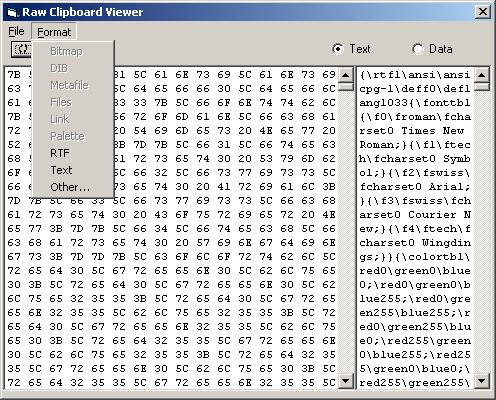

# [Lewie's Code Library PSC](../../README.md)

Open source projects that I had published to Planet Source Code.

## [Visual Basic](../README.md)

### Raw Clipboard Viewer

*3/19/2002 4:21:13 PM*

Working on a clip-board spy to understand how data is saved within the clipboard. Still cleaning up a few things - but it works for the most part.

