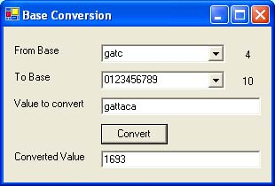

# [Lewie's Code Library PSC](../../README.md)

Open source projects that I had published to Planet Source Code.

## [VB.Net](../README.md)

### Base Conversion Utility

*3/17/2004 11:21:54 PM*

Converts a value from one customized base set to another. No longer are you bound to strict rules. zero does not necesarily have to represent nothing ... even create numbers in DNA (base-4 gatc). Try it out and see what it is all about. Comes with binary, octet, decimal, hex, morse-code, dna, and base64. (base 64 doesn't specifically mean normal base64 encoding)

