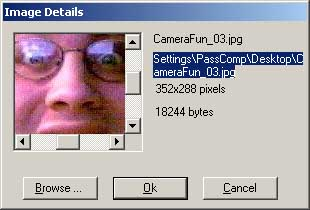
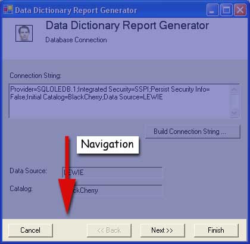
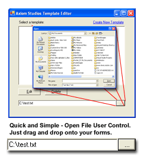
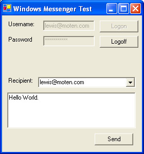
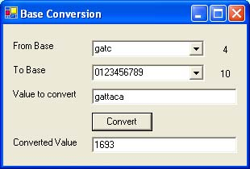
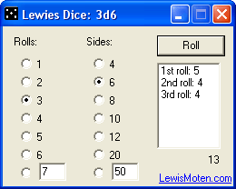
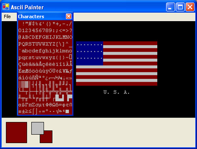
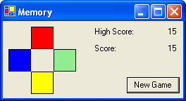

# [Lewie's Code Library PSC](../README.md)

Open source projects that I had published to Planet Source Code.

## VB.Net

### [clsRandomString](./clsRandomString)

*11/7/2002 3:01:42 PM*

Creates a variable length random string according to parameters you specify. MinLength, MaxLength, CharacterSet. Uses a Cryptography RandomNumberGenerator object to ensure an accurately random string.

### [BitmapTo/FromBase64](./BitmapToFromBase64)

*2/5/2003 12:18:16 AM*

Allows you to convert bitmap images to base64 and back for storage and retrieval in XML files.

### [GetResource](./GetResource)

*2/7/2003 7:23:44 PM*

Reads embeded files from your executable programs (such as xml, images, etc.) Allows you to distribute one program - the exe, but still access your data and images needed with the program.

### [Play WAV Files](./PlayWAVFiles)

*2/15/2003 11:06:05 AM*

Allows you to effortlessly play wave files in a seperate thread while your application continues to operate. Now supports playing embedded resource files and Streams.

### [Bitmap to Hue](./BitmapToHue)

*2/18/2003 9:35:59 PM*

Supply a bitmap and color and the bitmap is magically transformed to show colors from black to your color. Works with GIF images. Great for greyscale backgrounds that need to keep image but only change shades of color.

### [EnumerationList](./EnumerationList)

*4/12/2003 10:39:12 AM*

List the string values of any enumerated item that is flagged in your enumeration.

### [Crop Image](./CropImage)

*4/24/2003 11:07:59 PM*

Crops an image passed to the function. Returns resized image as a new bitmap.

### [Image Details Dialog](./ImageDetailsDialog)

*4/27/2003 2:21:09 AM*

Dialog box displays an image, its' file name, path, image dimensions, and file size. User may scroll to see full image, and browse to choose another image. If controls are too small, you can always resize them.

### [Wizard Navigation Control](./WizardNavigationControl)

*6/22/2003 12:31:47 PM*

Provides simple navigation through multiple steps that you may offer your users in an application. ie - a wizard setup program.

### [Image 2 HTML](./Image2HTML)

*9/4/2003 12:44:35 PM*

Converts an image to HTML table cells. Probably done many times before. This one also creates javascript to invert the image 1 pixel at a time.

### [Choose File User Control](./ChooseFileUserControl)

*9/13/2003 1:27:17 PM*

Drag and drop this control onto your forms so you can allow users to pick the files on there computer they want to use with your program. Pretty simple stuff.

### [CalcBytes](./CalcBytes)

*11/27/2003 6:53:04 PM*

converts number of bytes to a lower number, but changes measurement. (can changed kb's to gb's)

### [Small MSIM example](./SmallMsimExample)

*1/17/2004 10:54:07 AM*

quick and dirty example to use instant messenger with windows (MSIM). Logon, Logoff, Display contact list, send a message. Great for people researching for another way other then email to authenticate users.

### [Visual SourceSafe Journal Monitor Service](./VSSMonitorService)

*1/23/2004 12:13:14 AM*

VMS is a windows service developed in .Net that monitors a Microsoft Visual SourceSafe (VSS) database. Customized alerts may be sent based on the defined filters.

### [ID3v1.1 Reader](./ID3v1.1Reader)

*1/25/2004 12:14:40 PM*

Class reads ID3v1.1 tags - Artist, Sont Title, Track, Comment, Year, Album and year. Smaller code and reads more efficiently then other code I've seen on PSC as of today.

### [Base Conversion Utility](./BaseConversionUtility)

*3/17/2004 11:21:54 PM*

Converts a value from one customized base set to another. No longer are you bound to strict rules. zero does not necesarily have to represent nothing ... even create numbers in DNA (base-4 gatc). Try it out and see what it is all about. Comes with binary, octet, decimal, hex, morse-code, dna, and base64. (base 64 doesn't specifically mean normal base64 encoding)

### [Lewies Dice](./LewiesDice)

*7/30/2004 1:30:18 AM*

Gives you the option to roll any sided dice as many times as you want. Predefined formats with sides of 4, 6, 8, 10, 12, & 20. Fun utility for any AD&D hobbiest.

### [Lewies Ansi/Ascii Painter](./AsciiPainter)

*8/3/2004 12:58:28 AM*

Read and Edit *.ANS files.  Old BBS systems used to have Ansi files to display text as graphics before the days of the internet were popular.  This program can read just about any ansi file in ascii format and display it accurately.  It does not support Music or Animations.

### [Lewies Memory Game](./Memory)

*8/4/2004 12:30:19 AM*

This is a simple memory game. Start a new game. Wait for the squares to blink and repeat the pattern. An extra sequence is added after each round.

