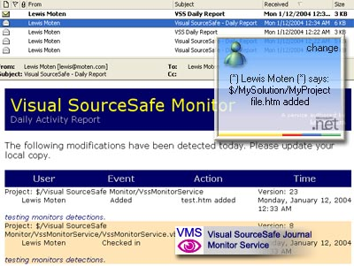

# [Lewie's Code Library PSC](../../README.md)

Open source projects that I had published to Planet Source Code.

## [VB.Net](../README.md)

### Visual SourceSafe Journal Monitor Service

*1/23/2004 12:13:14 AM*

VMS is a windows service developed in .Net that monitors a Microsoft Visual SourceSafe (VSS) database. Customized alerts may be sent based on the defined filters.

